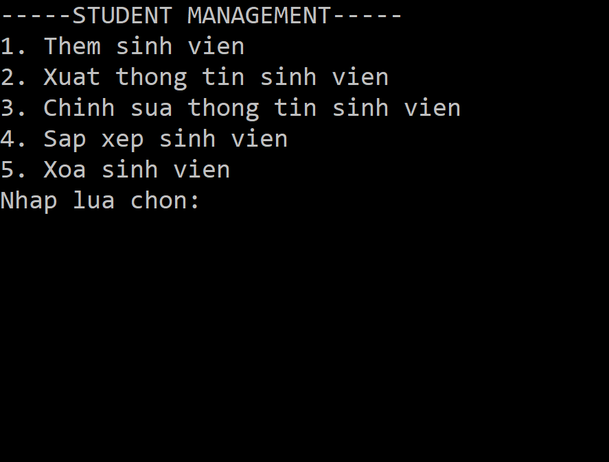

<h1>STUDENT MANAGEMENT</h1>
 
Chương trình quản lý sinh viên với yêu cầu như sau:
 
Về sinh viên: gồm có các thuộc tính mã sinh viên (số), tên sinh viên (chữ), tuổi (số), chuyên ngành (chữ), niên khóa (số). Chuyên ngành có thể là Hóa học, Sinh học, Toán học, Vật lý, Điện tử viễn thông. Mã sinh viên là một số nguyên có 7 chữ số, khi thêm sinh viên vào thì tự động tăng. 
Về trường: Trường có thể chứa tối đa 500 thông tin sinh viên. Có các chức năng: thêm/xóa, sắp xếp sinh viên. 
Anh/chị hãy viết mã chương trình, lưu ý trong bài làm bắt buộc phải sử dụng lớp trừu tượng và interface. Trong đó yêu cầu: 
a) Nhập thêm sinh viên mới bằng file sinhvien.txt và sử dụng ObjectInputStream. Có xử lý ngoại lệ (bỏ trống không nhập, nhập sai định dạng, nhập dữ liệu không nằm trong khoảng cho phép). 
b) Chỉnh sửa thông tin sinh viên đã có bằng cách nhập từ bàn phím. Có xử lý ngoại lệ (bỏ trống không nhập, nhập sai định dạng, nhập dữ liệu không nằm trong khoảng cho phép). 
c) Sắp xếp sinh viên với mã số sinh viên tăng dần và theo thứ tự chuyên ngành ở trên đề bài. Xuất ra kết quả thông qua file ketqua.txt. 
 

[][link]

[link]: #
